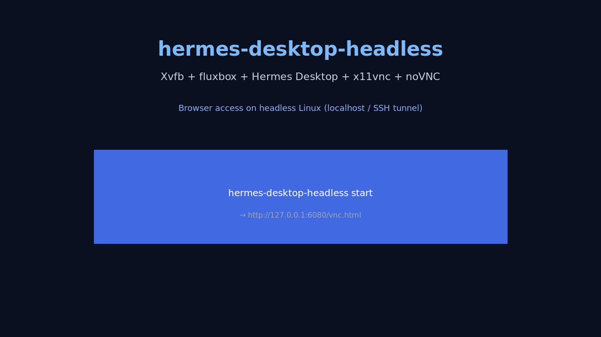
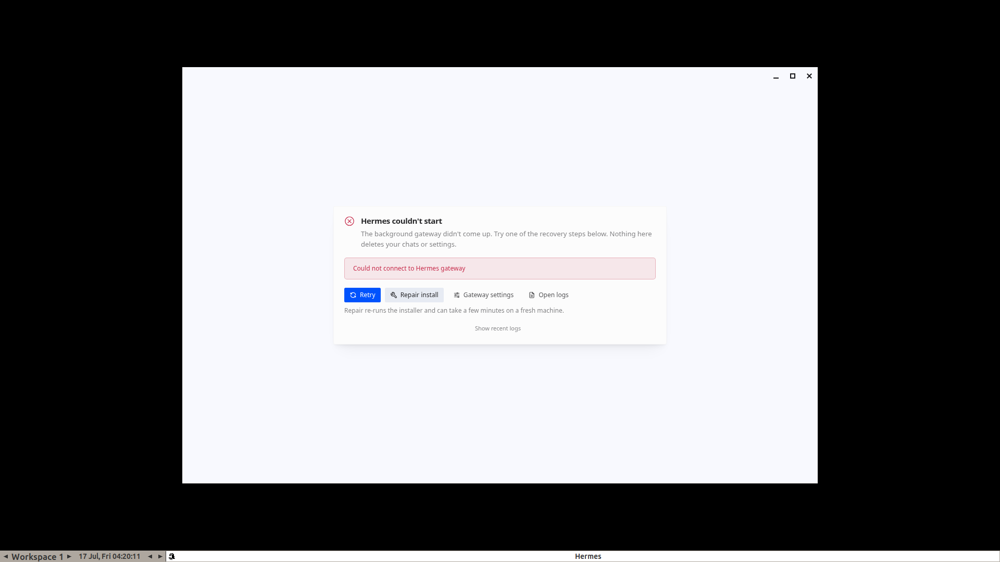
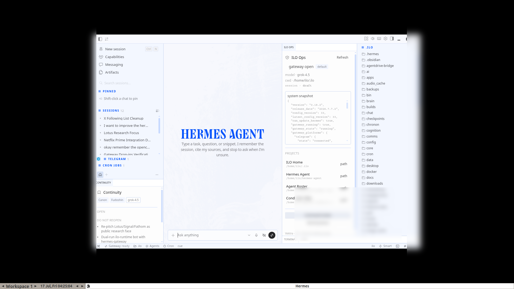

# hermes-desktop-headless

**Run [Hermes Desktop](https://hermes-agent.nousresearch.com/) on any headless Linux box** — VPS, bare metal, CI — without a physical monitor.

Virtual framebuffer + lightweight WM + VNC + browser client. Defaults to **localhost-only** access via SSH tunnel.

[](VERSION)
[](LICENSE)
[](https://github.com/PabloTheThinker/hermes-desktop-headless/actions/workflows/ci.yml)



## Features

- **One CLI**: `start` / `stop` / `status` / `screenshot` / `doctor` / `split` / `new-tab`
- **Portable deps**: Debian/Ubuntu, Fedora/RHEL, Arch, openSUSE package hints
- **WM auto-pick**: fluxbox → openbox → icewm → matchbox
- **noVNC discovery**: `/usr/share/novnc`, Arch webapps path, overrides
- **websockify**: binary or `python3 -m websockify`
- **Pointer-fidelity VNC**: low-latency x11vnc + drag-friendly noVNC URL (session tiling)
- **No-drag split CLI**: `split right` via xdotool when browser drag fails
- **Safe process kill**: only Electron on *our* `DISPLAY`, not every Hermes on the host
- **Stale SingletonLock cleanup** for Electron single-instance
- **Security default**: `HD_BIND=127.0.0.1`; non-loopback requires VNC password file
- **Documents** the Desktop session-token `.env` clobber bug + patch

See **[docs/MULTISESSION.md](docs/MULTISESSION.md)** for video-style multi-chat tiling over noVNC.

## Screenshots

### Boot failure (token clobber) → fixed stack





## Quick start

```bash
git clone https://github.com/PabloTheThinker/hermes-desktop-headless.git
cd hermes-desktop-headless
./scripts/install.sh --packages    # sudo: OS packages + ~/.local/bin link
# or without packages:
./scripts/install.sh

hermes-desktop-headless doctor --install-hints
hermes-desktop-headless start
```

From your laptop:

```bash
ssh -N -L 6080:127.0.0.1:6080 user@server
# browser:
http://127.0.0.1:6080/vnc.html?autoconnect=1&resize=remote
```

## Architecture

```text
  Browser ──► websockify:6080 (noVNC) ──► x11vnc:5901 ──► Xvfb:99
                                                              │
                                              fluxbox/openbox + Hermes Desktop
                                                              │
                                                    hermes serve --port 0
```

Industry-standard headless GUI pattern (Xvfb + x11vnc + noVNC), specialized for Hermes Desktop.

## Commands

| Command | Purpose |
|---------|---------|
| `start [--foreground] [--no-vnc] [--bind ADDR] [--display N]` | Bring stack up |
| `stop` / `restart` | Tear down / bounce |
| `restart-vnc` | Re-apply pointer-fidelity VNC flags only |
| `status` / `url` | Health + drag-friendly access URLs |
| `screenshot [path.png]` | Capture virtual display |
| `split [right\|left\|up\|down]` | **Open in split** without drag (needs `xdotool`) |
| `new-tab` | Ctrl+T new session tab (needs `xdotool`) |
| `doctor [--install-hints]` | Dependency check + distro install line |
| `version` | Print package version |

## Environment

| Variable | Default | Notes |
|----------|---------|-------|
| `HD_DISPLAY` | `99` | X display number |
| `HD_GEOMETRY` | `1920x1080x24` | Xvfb screen |
| `HD_VNC_PORT` | `5901` | RFB |
| `HD_NOVNC_PORT` | `6080` | Browser |
| `HD_BIND` | `127.0.0.1` | Listen address |
| `HD_STATE_DIR` | `~/.local/state/hermes-desktop-headless` | PIDs + logs |
| `HD_HERMES_CMD` | `hermes desktop --skip-build` | Launch command |
| `HD_WM` | _(auto)_ | Prefer a specific WM |
| `HD_NOVNC_WEB` | _(auto)_ | noVNC static root |
| `HD_VNC_PASSWORD_FILE` | _(empty)_ | Required if not loopback |
| `HD_WAIT_HERMES_SEC` | `45` | Electron ready timeout |

## Security

1. **Loopback by default** — VNC/noVNC not on the public internet  
2. **Non-loopback refused** without `HD_VNC_PASSWORD_FILE` (`x11vnc -storepasswd`)  
3. Prefer **SSH tunnel** or **Tailscale** over opening ports  

```bash
x11vnc -storepasswd ~/.config/hermes-desktop-headless/vnc.pass
export HD_VNC_PASSWORD_FILE=~/.config/hermes-desktop-headless/vnc.pass
# still prefer not exposing 0.0.0.0 to the open WAN
```

## Hermes session-token bug

Desktop mints `HERMES_DASHBOARD_SESSION_TOKEN` for each spawned backend.  
`load_hermes_dotenv()` loads `~/.hermes/.env` with **`override=True`**, which can overwrite that mint → Electron **401** → *“Could not connect to Hermes gateway”*.

Upstream issue class: [NousResearch/hermes-agent#39349](https://github.com/NousResearch/hermes-agent/issues/39349)

**Workarounds:**
1. Apply [`patches/0001-preserve-desktop-session-token.patch`](patches/0001-preserve-desktop-session-token.patch) to your hermes-agent tree  
2. Or remove `HERMES_DASHBOARD_SESSION_TOKEN` from `~/.hermes/.env` and relaunch  

## Multisession / layout (X-demo class)

With Desktop up in noVNC (use the URL from `hermes-desktop-headless url`):

1. **Right-click New session → Open in split → Right** — side-by-side chats  
2. **Ctrl+T** or `hermes-desktop-headless new-tab` — new session tab  
3. **Ctrl+click** a session — open as tab  
4. Drag session to chat **edge** — split (requires `resize=remote` URL)  
5. **No drag?** `hermes-desktop-headless split right`

Full guide: **[docs/MULTISESSION.md](docs/MULTISESSION.md)**.

```bash
# apply pointer-fidelity flags if you started before v0.3
hermes-desktop-headless restart-vnc
hermes-desktop-headless split right
```

## systemd (user)

```bash
mkdir -p ~/.config/systemd/user
cp systemd/hermes-desktop-headless.service ~/.config/systemd/user/
systemctl --user daemon-reload
systemctl --user enable --now hermes-desktop-headless.service
```

## Development

```bash
make check    # bash -n + shellcheck
make smoke    # offline unit tests (Hermes optional)
make doctor
./scripts/install.sh [--packages]
```

See [CONTRIBUTING.md](CONTRIBUTING.md).

## Troubleshooting

| Symptom | Fix |
|---------|-----|
| `Missing X server or $DISPLAY` | Use this tool, not bare `hermes desktop` |
| Doctor MISS packages | `./scripts/install.sh --packages` or `doctor --install-hints` |
| Boot overlay 401 | Session-token patch / remove token from `.env` |
| Singleton lock | `stop` clears dead locks; or delete `~/.config/Hermes/Singleton*` if PID dead |
| Port busy | `HD_DISPLAY=98 HD_VNC_PORT=5902 HD_NOVNC_PORT=6081 start` |

Logs: `$HD_STATE_DIR/logs/` (`xvfb`, `wm`, `hermes-desktop`, `x11vnc`, `novnc`).

## License

MIT — see [LICENSE](LICENSE).  
Hermes Agent / Desktop: Nous Research upstream licenses.

## About

See [ABOUT.md](ABOUT.md).
